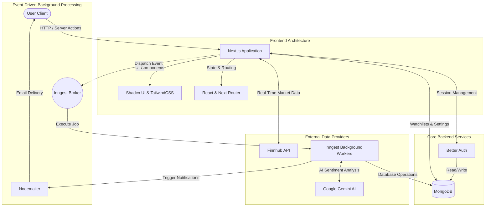

# Singleton - Advanced Stock Tracker & AI Insights Platform

## Introduction

Singleton is a modern, AI-powered financial application designed for real-time stock market tracking, personalized alerting, and intelligent market insights. Built on Next.js, it leverages a robust event-driven architecture to provide asynchronous background processing for market updates, bypassing the traditional limitations of standard serverless environments. 

With seamless authentication, direct integration with global market APIs, and intelligent data summarization via Google Gemini, Singleton offers investors a comprehensive and automated toolkit for monitoring financial markets.

## System Architecture

Singleton is built on a highly modular, event-driven architecture that separates the user interface from heavy background processing.

## Data Flow & Integration

1. **Client to Server Communication**: User interactions (such as creating a watchlist or setting a price alert) are processed via Next.js Server Actions, ensuring type safety and reducing client-side bundle size.
2. **Authentication Layer**: Handled natively by Better Auth using secure HTTP-only cookies and a direct MongoDB adapter for session persistence.
3. **Market Data Pipeline**: The application fetches real-time financial data, historical candlestick charts, and company metrics from the Finnhub API. 
4. **Asynchronous Background Jobs**: Inngest acts as the central event broker. Heavy tasks (like sending welcome emails, checking stock prices against user thresholds, or compiling daily AI summaries) are offloaded to Inngest workers. This prevents UI blocking and ensures reliable retries on failure.
5. **AI Summarization**: Google Gemini is integrated into the background workers to parse raw market news and earnings reports, converting them into concise, personalized insights delivered to the user.

## Technology Stack

- **Framework**: Next.js 15 (App Router, Server Components)
- **Language**: TypeScript
- **Styling & UI**: TailwindCSS, Shadcn UI
- **Database**: MongoDB (managed via Mongoose ORM)
- **Authentication**: Better Auth
- **Event-Driven Workflows**: Inngest
- **External Services**: 
  - Finnhub (Market Data)
  - Google Gemini (AI Insights)
  - Nodemailer (Email Delivery)

## Core Features

- **Real-Time Stock Dashboard**: Track live stock prices with interactive line and candlestick charts. Filter historical data and navigate stocks by industry, performance, or market capitalization.
- **Intelligent Search Engine**: Quickly query and find equities across global markets using an optimized search architecture.
- **Watchlists & Threshold Alerts**: Create personalized watchlists. Set specific alert thresholds for price movements or volume spikes.
- **Automated Workflows**: Powered by Inngest, the platform automatically schedules price checks and executes background workflows without user intervention.
- **AI-Powered Insights**: Receive daily digests, earnings report notifications, and sentiment analysis summaries generated by AI.
- **Company Fundamentals**: Explore deep financial data including PE ratios, EPS, revenue trends, recent filings, and analyst ratings.
